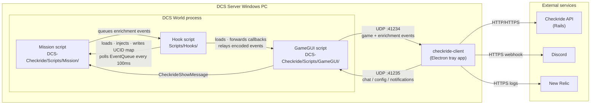
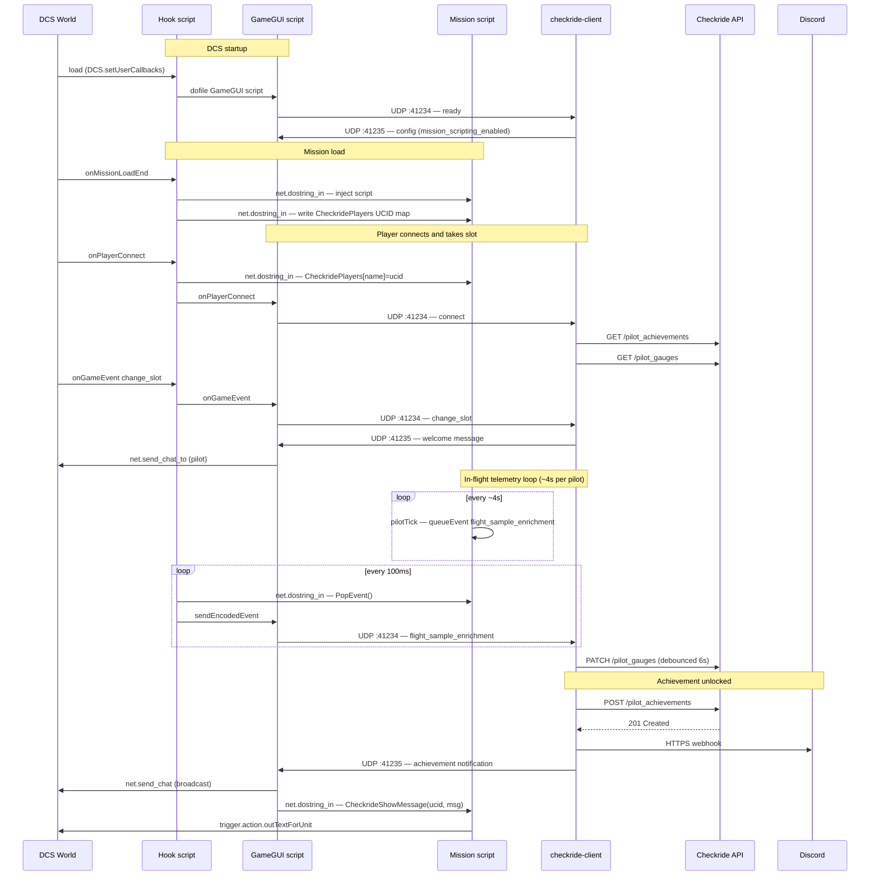

# Architecture

## System overview



## Sequence diagram

Key lifecycle flows: DCS startup, player session, in-flight telemetry, and achievement unlock.



## Transport layers

| Direction | Protocol | Port | Purpose |
|---|---|---|---|
| DCS → client | UDP | 41234 | Lua events (kills, landings, telemetry frames, etc.) |
| client → DCS | UDP | 41235 | In-game chat messages and config pushes |
| client → API | HTTP or HTTPS | configured | Events, achievements, gauges, heartbeat, healthcheck |
| client → Discord | HTTPS | 443 | Webhook notifications |
| client → New Relic | HTTPS | 443 | Structured log shipping |

## DCS World

The three Lua scripts run inside the DCS process on the same machine. They operate in separate sandbox environments and communicate via `net.dostring_in` across the sandbox boundary.

### Hook script (`Scripts/Hooks/`)

Runs at DCS startup. The single owner of `DCS.setUserCallbacks` — all DCS event callbacks route through here first, then are forwarded to GameGUI. Has `net.*` access (player list, UCIDs, `dostring_in`).

Responsibilities:
- Loads GameGUI on startup via `pcall(dofile(...))`
- Forwards DCS callbacks to GameGUI: `onGameEvent`, `onPlayerConnect`, `onPlayerDisconnect`, `onSimulationFrame`, `onNetConnect`, `onChatMessage`
- On `onMissionLoadEnd`: injects the Mission script into the `'server'` sandbox via `net.dostring_in`
- On player connect/disconnect: writes/clears `CheckridePlayers[name]=ucid` in the mission sandbox so Mission can resolve UCIDs without `net.*`
- Every 100ms (on `onSimulationFrame`): polls `CheckrideMission.PopEvent()` via `net.dostring_in` and forwards each encoded event to `Checkride.sendEncodedEvent()` (GameGUI) → UDP 41234

### GameGUI script (`DCS-Checkride/Scripts/GameGUI/`)

Runs in the GameGUI environment. Owns both UDP sockets.

Responsibilities:
- **Sends** game events over UDP :41234 to the client: `connect`, `disconnect`, `change_slot`, `ready`, `kill`, `takeoff`, `landing`, `crash`, `eject`, `pilot_death`, `self_kill`, `friendly_fire`
- **Receives** encoded Mission events relayed from Hook and forwards them over UDP :41234
- **Listens** on UDP :41235 for incoming JSON payloads from the client
- On `config` payload: applies `mission_scripting_enabled` setting
- On `achievement`/`proficiency` payload: broadcasts via `net.send_chat` / `net.send_chat_to`, then calls `CheckrideShowMessage` in the mission sandbox via `net.dostring_in` to show an on-screen message to the specific pilot
- On `info` payload: sends targeted DCS chat to the pilot's UCID

### Mission script (`DCS-Checkride/Scripts/Mission/`)

Runs in the `'server'` sandbox (mission scripting environment). No `net.*` access — communicates outward by queuing events for Hook to poll.

Responsibilities:
- Registers `world.addEventHandler` for: `S_EVENT_LANDING_QUALITY_MARK`, `S_EVENT_TAKEOFF`, `S_EVENT_LAND`, `S_EVENT_KILL`, `S_EVENT_SHOT`, `S_EVENT_HIT`, `S_EVENT_SHOOTING_START`, `S_EVENT_SHOOTING_END`
- Queues enrichment events (all `persist: false`) into `CheckrideMission.EventQueue` for Hook to drain:
  - `flight_sample_enrichment` — per-pilot speed/alt/fuel/ammo/position (sampled every ~4s per pilot)
  - `takeoff_enrichment` / `landing_enrichment` — carrier detection, airbase coalition
  - `kill_enrichment` — victim category, carrier distance, weapon class/guidance
  - `hit_enrichment` — weapon impact distance and height delta
  - `shot_enrichment` / `weapon_sample_enrichment` — weapon tracking while in flight
  - `refuel_enrichment` — AAR detection via fuel delta sampling
  - `grading` — LSO carrier landing grade (wire, grade, night)
  - `gun_burst_start` / `gun_burst_end` — gun firing intervals
  - `inbound_missile` / `inbound_missile_hit` — SAM/AAM threats targeting a player
  - `friendly_killed_enrichment` — friendly aircraft killed
- Resolves pilot UCIDs from `CheckrideLookupUCID(playerName)` — a function injected by Hook
- Exposes `CheckrideShowMessage(ucid, msg, duration)` — called by GameGUI via `net.dostring_in` to show `trigger.action.outTextForUnit()` on the pilot's screen

## Checkride API

All calls use Bearer token auth (`Authorization: Bearer <token>`) and include `X-Checkride-Client-Version`.

| Call | Method | Path | When |
|---|---|---|---|
| Save event | POST | `/events` | Every persistable DCS event |
| Save achievement | POST | `/pilot_achievements` | Achievement unlocked |
| Fetch achievements | GET | `/pilot_achievements?player_ucid=` | On pilot connect / change_slot |
| Fetch gauges | GET | `/pilot_gauges?player_ucid=` | On pilot connect / change_slot (via GaugeSync) |
| Update gauge | PATCH | `/pilot_gauges/:id` | When pilot sets a new personal best (debounced 6s, flushed on land/crash/disconnect) |
| Heartbeat | POST | `/heartbeat` | Every 60s with connected player count |
| Healthcheck | GET | `/up` | Every 5s (tray icon colour) |

The API response to `POST /events` drives downstream notifications — it returns `summary` (Discord message text), `publish` (bool), and `proficiencies` (array of newly earned proficiency messages).

## Discord

Notifications are sent via a single configurable webhook URL to `discord.com`. The client serialises sends through a promise queue and respects Discord's rate-limit headers (`X-RateLimit-Remaining`, `X-RateLimit-Reset-After`). On 429 it backs off and retries up to 3 times.

Messages sent:
- Event summary (from API response `summary` field)
- Proficiency unlocks (from API response `proficiencies`)
- Achievement unlocks (client-side, after `POST /pilot_achievements` confirms it's new)

## New Relic

Fire-and-forget structured log shipping to `log-api.newrelic.com/log/v1`. No-op when `NEW_RELIC_LICENSE_KEY` is not set (or not baked at build time). Used for production observability — startup, health state changes, heartbeats, and `flight_sample_enrichment` UCID-missing events. The server name is lazily set from the first heartbeat API response.

## Event pipeline (detail)

```
UDP packet arrives at :41234
        │
        ▼
UDPServer.onEvent(event)
        │
        ├─ update connectedPlayerCount from event.playerCount
        ├─ UCID resolution: fill event.playerUcid from ucidByName map if missing
        │
        ├─ event.type === 'ready'
        │   └─ Lua version check → warn dialog if mismatch
        │   └─ push mission scripting config → DCS :41235
        │
        ├─ connect / change_slot (flyable)
        │   └─ SortieLogger.startSortie()
        │   └─ AchievementEngine.resetPilot()
        │   └─ AchievementEngine.loadAchievementsFromApi()  [async]
        │   └─ send welcome message → DCS :41235  [first slot only]
        │
        ├─ land / crash / disconnect
        │   └─ SortieLogger.endSortie()
        │
        ├─ persist === false  (flight_sample_enrichment, hit_enrichment, etc.)
        │   └─ AchievementEngine.evaluate(event)
        │   └─ GaugeSync.syncSnapshot()  [debounced 6s, immediate on terminal events]
        │   └─ SortieLogger.logSnapshot()  [flight_sample_enrichment only]
        │   └─ for each newly unlocked achievement:
        │       └─ POST /pilot_achievements
        │       └─ send achievement message → DCS :41235
        │       └─ send achievement message → Discord webhook
        │
        └─ persist === true  (kills, takeoffs, landings, AAR, etc.)
            └─ EventFactory.create(event)  → GameEvent
            └─ gameEvent.prepare()  → payload
            └─ AchievementEngine.evaluate(event)
            └─ GaugeSync.syncSnapshot()
            └─ EventProcessor.process()
            │   ├─ AirborneTracker.apply()  → attaches duration_seconds to landings
            │   └─ stamps deterministic event_uid (UUIDv5)
            └─ POST /events → API response
            └─ Discord: summary + proficiencies
            └─ DCS :41235: proficiency messages
            └─ for each newly unlocked achievement:
                └─ POST /pilot_achievements
                └─ DCS :41235 + Discord
```

## Local disk

`SortieLogger` writes per-pilot JSONL flight logs under the app's user data directory, one file per sortie (`<ucid>/<iso-timestamp>.jsonl`). Each file contains a `sortie_start` header, a stream of `flight_sample_enrichment` state snapshots, and a `sortie_end` footer with the termination reason. Files older than 7 days are purged on startup.
